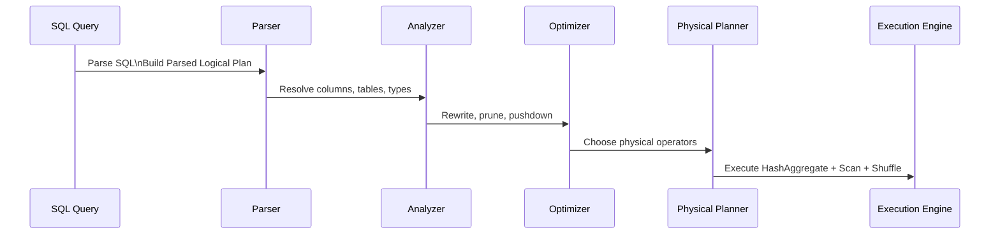

```mermaid
sequenceDiagram
    participant SQL as SQL Query
    participant Parser as Parser
    participant Analyzer as Analyzer
    participant Optimizer as Optimizer
    participant Planner as Physical Planner
    participant Exec as Execution Engine

    SQL->>Parser: Parse SQL\nBuild Parsed Logical Plan
    Parser->>Analyzer: Resolve columns, tables, types
    Analyzer->>Optimizer: Rewrite, prune, pushdown
    Optimizer->>Planner: Choose physical operators
    Planner->>Exec: Execute HashAggregate + Scan + Shuffle
```
